<h1>API para que puedas consultar a las galletas de la fortuna.</h1>

Desarrollada en python con Flask

Autores: 
Manolo Revelo 
Sebastian Sandoval 
Isaac Mora 

<h2 align="center"> Evidencias</h2>

### Uso de Docker
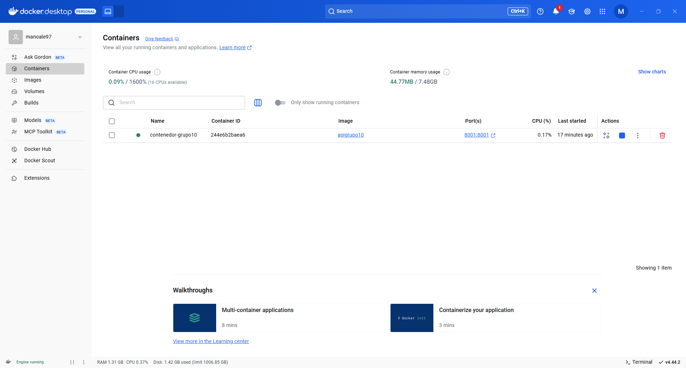

### Método: GET sin ruta asociada
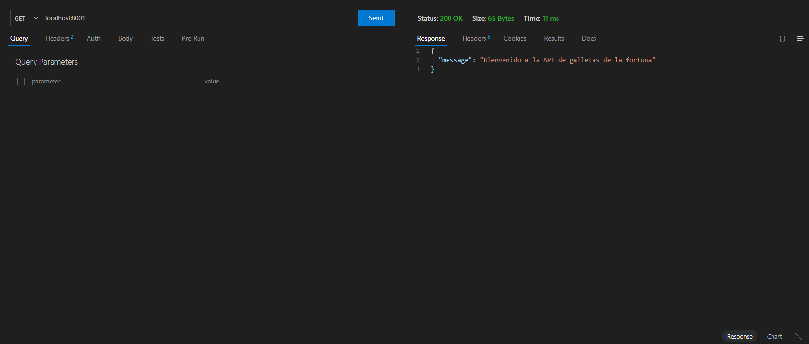

Cuando un usuario accede a la raíz del servidor, la función devuelve un mensaje de bienvenida en formato JSON.

### Método: Info
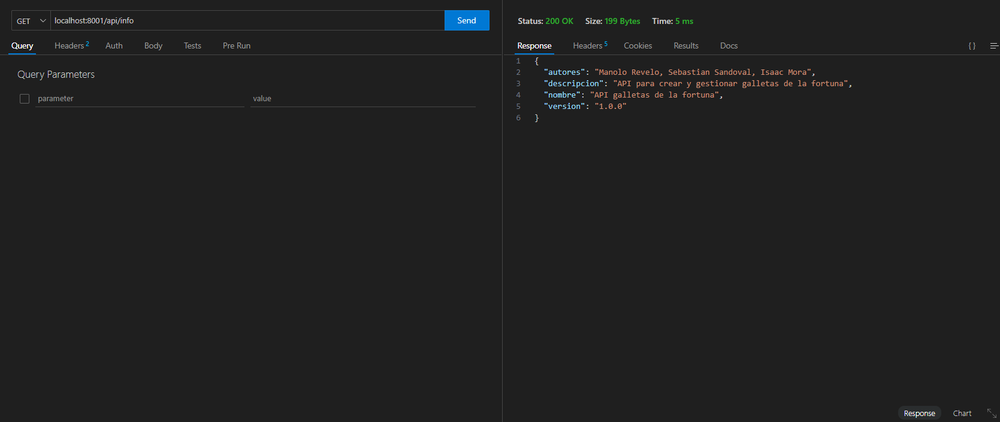

Devuelve un objeto JSON con datos como el nombre del proyecto, la versión actual, una breve descripción y los autores.

### Método: Obtener frase invitado
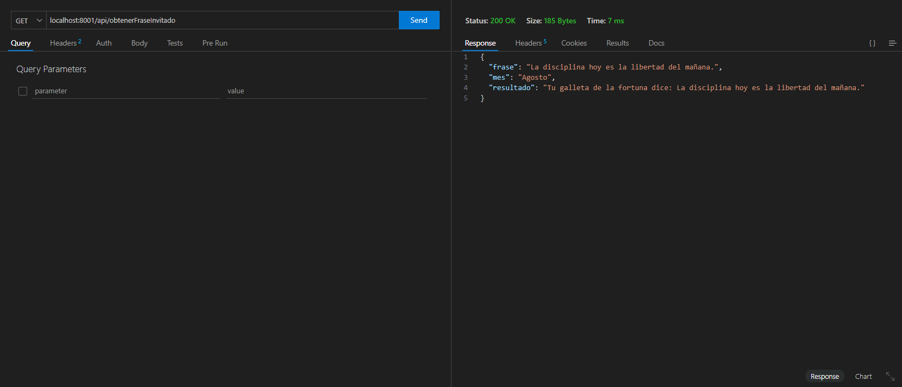

Permite a un usuario invitado obtener una frase de la fortuna basada en el mes actual.

### Método: Abrir galleta
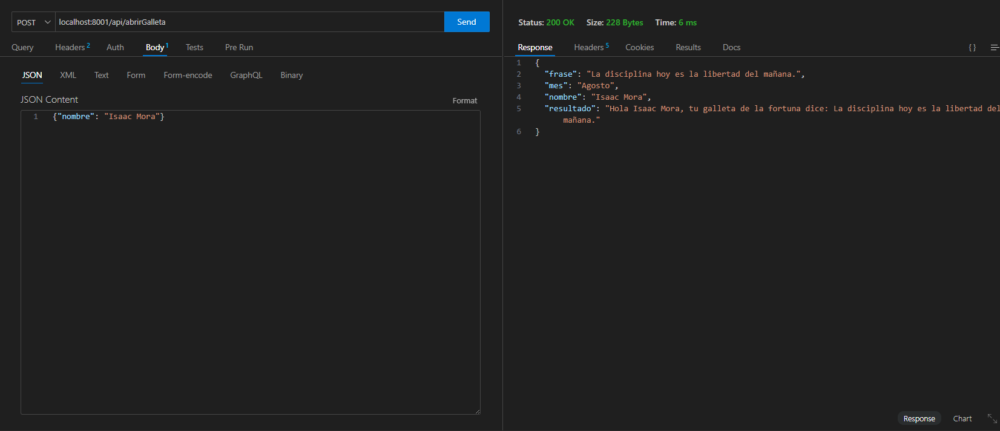

Esta ruta permite a un usuario recibir una frase personalizada de la galleta de la fortuna enviando su nombre mediante una solicitud   POST. La frase se selecciona aleatoriamente entre un conjunto de frases específicas del mes actual.

### Método: Obtener frases 
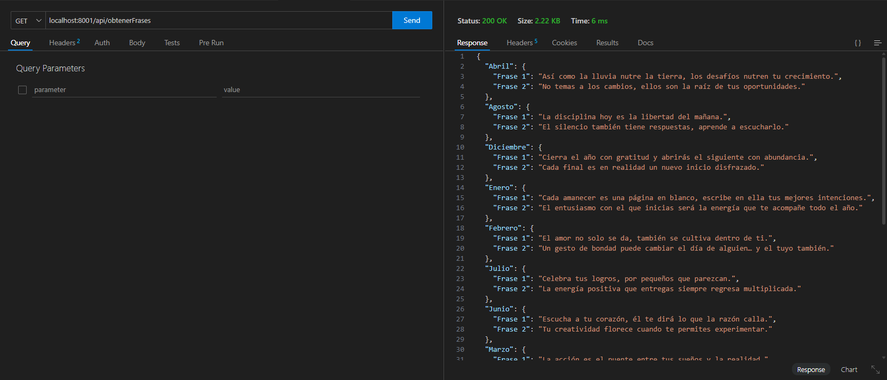

Esta ruta permite obtener todas las frases de la fortuna disponibles, organizadas por mes.

### Método: Actualizar frases
Detalle: Se agrega una frase al mes Agosto.
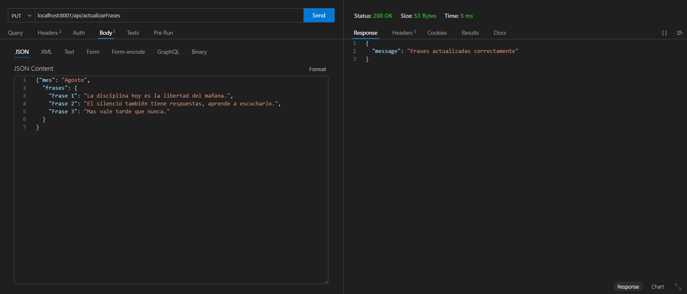

Permite actualizar las frases de la fortuna correspondientes a un mes específico.

### Evidencia
Detalle: Frase agregada.
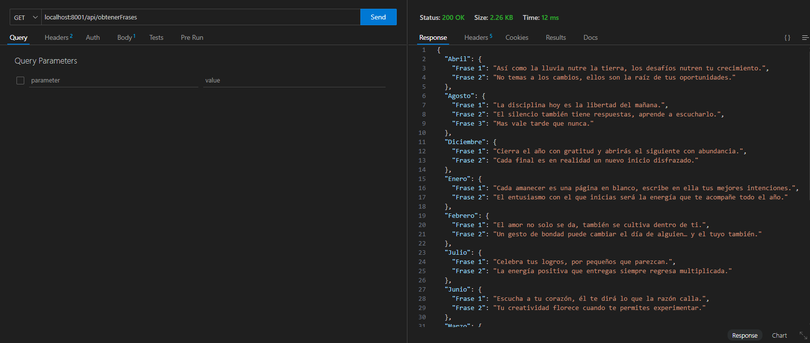

### Método: Borrar frase
Detalle: Se elimina una frase del mes Enero.
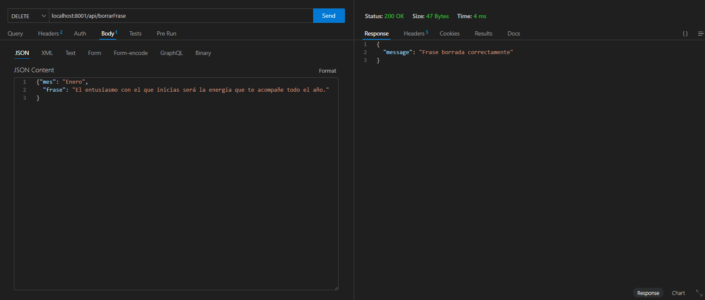

Permite eliminar las frases de la fortuna correspondientes a un mes específico.

### Evidencia
Detalle: Se evidencia que solo se tiene una frase en el mes de Enero.
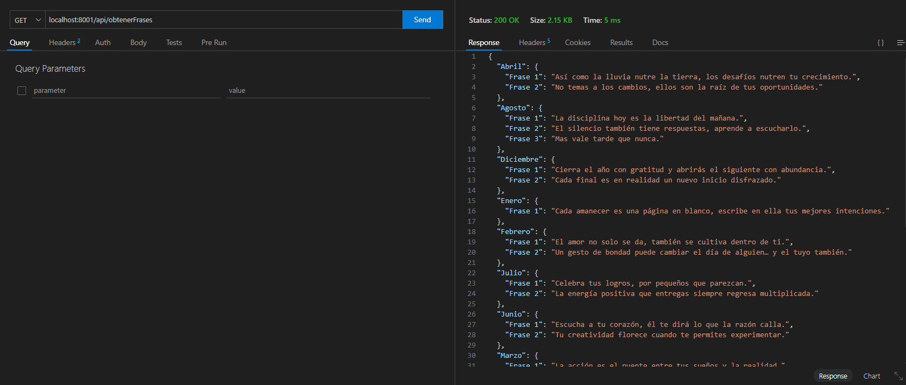

### Método: Crear frase
Detalle: Se agrega una nueva frase en el mes Enero.
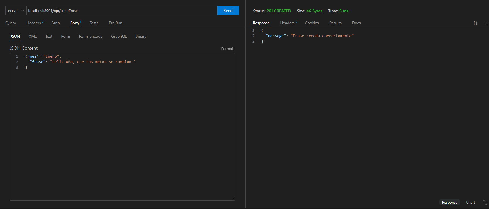

Permite crear las frases de la fortuna en un mes específico.

### Evidencia
Detalle: Se evidencia que se agrego una nueva frase en el mes Enero.
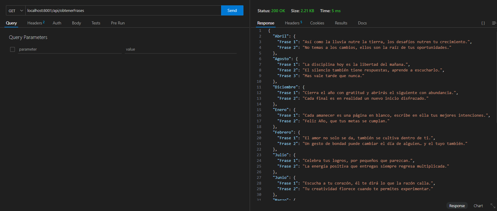
